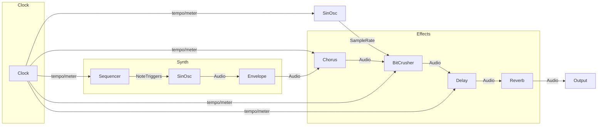

# Code 

The code portion of this assignment is an experiment in low-level sound design for the browser.

Looking back at [Assignment1](../../Assignment1/) and [Assignment2](../Assignment2/), these were high-level etudes in which ChatGPT was prompted to create and recreate a piece of music in different audio programming languages. A feature of both of them was a "Blade Runner synth," which I found to be lackluster in both of them.

Exploring [Gibber](https://gibber.cc/) this week, I came across the [`moody`](https://gibber.cc/) preset, which really blew me away. It sounds gorgeous, and has a synth lead that is unquestionably Blader Runner. (Keep in mind, I'm not a "synthesis guy," but there is the occasional synth sound that grabs me and makes me feel. This was one of those.)

I investigated https://github.com/charlieroberts/gibber.audio.lib to find the synth preset, so that I may recreate it with low-level, per-sample operators in both C++ (which I know a little of) and JS (which I know almost nothing of).

Below is the preset, from https://github.com/charlieroberts/gibber.audio.lib/blob/main/js/presets.js.

```js
cry: {
  attack:1/2, decay:1.5, gain:.045,
  panVoices:true,
  presetInit: function( audio ) {
    this.chorus = audio.effects.Chorus('lush', { isStereo:true })
    this.fx.add( this.chorus  )
    this.bitCrusher = audio.effects.BitCrusher({ bitDepth:.5, isStereo:true })
    this.fx.add( this.bitCrusher )
    //// gen( .5 + cycle( btof(16) ) * .35
    this.srmod = audio.Gen.make( audio.Gen.ugens.add( .5, audio.Gen.ugens.mul( audio.Gen.ugens.cycle(.125/2), .35 ) ) )
    this.bitCrusher.sampleRate = this.srmod
    this.delay = audio.effects.Delay({ time:1/6, feedback:.75 })
    this.fx.add( this.delay )
  }
}
```

The basic signal graph can be expressed by the following block diagram (I think...):



I'm going to try and implement this first in C++ with my audio library [Gimmel](https://github.com/jaffco/Gimmel), and then in JS with [Genish](https://github.com/charlieroberts/genish.js/).

CURRENT PROGRESS: working on the C++ implementation. Grab the git submodule for bladepad and run `./init.sh`, `./run.sh src/bladepad.cpp`.


